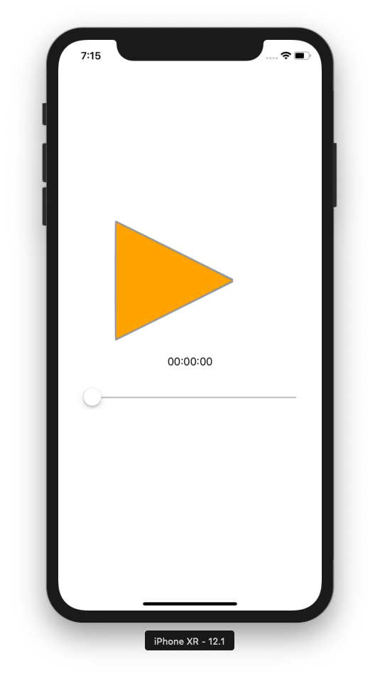
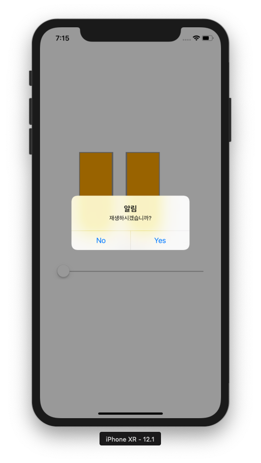

# MusicPlayer
- [Timer](#Timer)
    - 재생버튼 클릭시 타이머가 실행됨
    - 타이머가 실행 되면서 콜백함수를 호출
    - Label을 타이머의 현재값으로 수정
    - slider값을 타이머의 현재값으로 수정
- [Alert](#Alert)
    - alert를 띄워서 yes클릭시 음악이 재생됨
- [이미지](##img)

# Timer
- 타이머 콜백함수
``` swift
self.timer = Timer.scheduledTimer(withTimeInterval: 0.01, repeats: true, block: {(timer: Timer) in
```

withTimeInterval: 타이머 실행주기

block: 콜백시 실행시킬 코드, 함수


# Alert
>### <b>alert 타이틀, 메시지, 스타일 지정</b>
``` swift
let msg = "재생하시겠습니까?"

let alert: UIAlertController = 
UIAlertController(title: "알림", message: msg, preferredStyle: UIAlertController.Style.alert)
```

>### <b>alert에 대한 action작성</b>

- yes버튼 클릭시 action
``` swift
let okAction: UIAlertAction = UIAlertAction(title: "Yes", style: UIAlertAction.Style.default, handler: {(action:UIAlertAction) -> Void in
                self.dismiss(animated: true, completion: nil) // yes 누르면 alert 사라짐

})
```

- no버튼 클릭시 action
``` swift
let noAction: UIAlertAction = UIAlertAction(title: "No", style: UIAlertAction.Style.default, handler: {(action:UIAlertAction) -> Void in
                self.dismiss(animated: true, completion: nil) // no 누르면 alert 사라짐
})
```

>### <b> alert action추가하기, 뷰에 적용하기</b>
``` swift
alert.addAction(noAction)  // alert action추가, 추가한순서대로 왼쪽부터 나열됨

alert.addAction(okAction)

self.present(alert, animated: true, completion: nil)  //해당 컨텐츠(alert)를 모달형식으로 띄움
```
---
## img
<center> 


</center> 